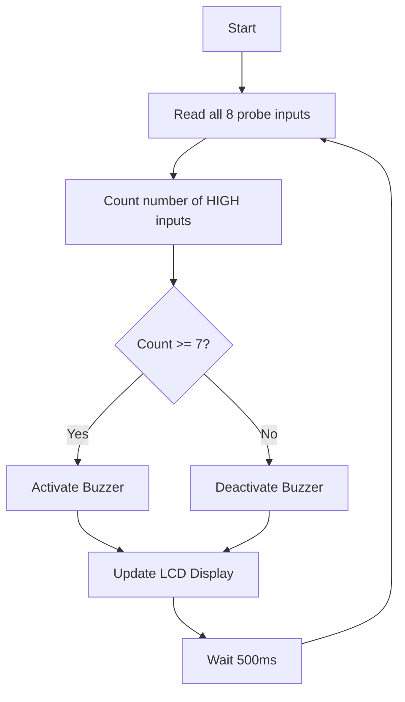

# CHAPTER 3

# SPRINT PLANNING AND EXECUTION METHODOLOGY

## 3.1 SPRINT I — Sensor Interface and Logic Gate Design

### 3.1.1 Objectives with User Stories of Sprint I

The primary goal of Sprint I was to design and validate the water level sensing subsystem. This involved building the conductive probe assembly, designing the logic gate signal conditioning circuit, and verifying that reliable digital signals could be obtained from water contact events.

**Table 3.1: Sprint I User Stories and Acceptance Criteria**

| User Story ID | User Story | Acceptance Criteria | Status |
|---|---|---|---|
| US-01 | As a user, I want the system to detect water at 8 discrete levels in my tank. | Each of the 8 probes produces a measurable voltage change when submerged in tap water. | Completed |
| US-05 | As a user, I want the probe signals to be clean and noise-free. | Logic gates output stable HIGH/LOW signals with no oscillation or noise spikes. | Completed |

The sensing principle adopted in this project is based on the electrical conductivity of water. Pure distilled water is a poor conductor of electricity, but tap water, groundwater, and most natural water sources contain dissolved minerals such as calcium, magnesium, sodium, and chloride ions. These dissolved ions make the water conductive, typically exhibiting a conductivity in the range of 200 to 800 microsiemens per centimetre for Indian tap water [1]. When two metallic electrodes are placed in such water, a measurable current flows between them proportional to the applied voltage and the water's conductivity.

In this system, nine stainless steel rods are used as electrodes. One rod serves as the common ground reference and is placed at the very bottom of the tank, ensuring it is always submerged. The remaining eight rods (labelled L1 through L8) are placed at equally spaced vertical intervals from the bottom to near the top of the tank. Each sensing rod is connected to one terminal of a pull-down resistor network, while the common ground rod is connected to the positive supply voltage (5V) through a current-limiting resistor. When water is absent at a particular probe level, the circuit remains open and the pull-down resistor holds the probe output at logic LOW (0V). When water rises to that probe's level, it bridges the gap between the probe and the common ground rod, completing the circuit. Current flows through the water, and the voltage at the probe point rises to a level sufficient to be read as logic HIGH by the subsequent stage.

*[Insert Figure 3.1: Conductive Probe Sensing Principle — A circuit diagram showing one probe connected through water to the ground probe, with pull-down resistor and voltage measurement point]*

**Fig 3.1: Conductive Probe Sensing Principle**

The choice of stainless steel (grade SS304) for the probe material was deliberate. Stainless steel offers excellent corrosion resistance in water, is food-safe, readily available in hardware stores, and is inexpensive. Copper was considered as an alternative but rejected due to its tendency to form verdigris (copper carbonate) in the presence of water and air, which would increase contact resistance over time and degrade sensing reliability.


### 3.1.2 Functional Document

The functional requirements of the sensing subsystem are as follows:

**FR-1: Multi-Level Detection.** The system shall detect water presence at eight discrete vertical positions within the tank. The spacing between probes shall be uniform, dividing the usable tank height into eight equal segments. Each probe shall independently indicate whether water has reached its level.

**FR-2: Signal Conditioning.** The raw signals from the probes, which may be noisy due to water turbulence, partial contact, or electromagnetic interference, shall be conditioned through digital logic gates to produce clean, stable digital outputs. Each probe signal shall pass through one input of a two-input AND gate (IC 74LS08). The second input of each AND gate shall be tied to a stable logic HIGH through a pull-up arrangement, so that the AND gate effectively acts as a buffer and threshold detector. When the probe signal exceeds the logic HIGH threshold of the 74LS08 (approximately 2.0V for TTL logic), the gate output goes HIGH. When the probe signal is below the threshold, the output remains LOW.

**FR-3: Sequential Activation.** Due to the physical arrangement of the probes (L1 at the bottom, L8 at the top), the system inherently provides sequential activation as water rises. When the tank is empty, all eight gate outputs are LOW. As water fills from the bottom, L1 activates first, followed by L2, L3, and so on. This sequential nature simplifies the firmware logic — the Arduino only needs to count the number of HIGH inputs to determine the water level.

**FR-4: Noise Immunity.** The logic gate stage shall provide a minimum noise margin of 0.4V (the standard TTL noise margin) to prevent false triggering due to electrical noise, water splashing, or momentary partial contact with the probes.

**Truth Table for Logic Gate Operation:**

**Table 3.2: Logic Gate Truth Table for Level Detection**

| Probe in Water | Probe Voltage | AND Gate Input A | AND Gate Input B (Tied HIGH) | AND Gate Output | Interpretation |
|---|---|---|---|---|---|
| No | ~0V (LOW) | 0 | 1 | 0 | Water below this level |
| Yes | ~3.5V (HIGH) | 1 | 1 | 1 | Water at or above this level |

The 74LS08 IC contains four AND gates in a single 14-pin DIP package. Therefore, two 74LS08 ICs are required to condition all eight probe signals. The pin assignments for the two ICs are as follows:

- IC1 (74LS08 #1): Gates for probes L1, L2, L3, L4
- IC2 (74LS08 #2): Gates for probes L5, L6, L7, L8

*[Insert Figure 3.2: Logic Gate Configuration for Level Detection — A schematic showing the 74LS08 ICs with input connections from probes and output connections to Arduino]*

**Fig 3.2: Logic Gate Configuration for Level Detection**


### 3.1.3 Architecture Document

The architecture of the sensing subsystem consists of three layers:

**Physical Layer:** This comprises the nine stainless steel probes mounted inside the tank. The probes are held in position by a vertical PVC mounting strip attached to the inside wall of the tank. Each probe extends horizontally into the tank by approximately 100 mm, ensuring adequate contact area with the water. Insulated wires run from each probe through sealed cable glands in the tank wall to the external circuitry.

**Signal Conditioning Layer:** This layer consists of the two 74LS08 AND gate ICs, pull-down resistors (10 kΩ) for each probe, and current-limiting resistors (1 kΩ) in the common ground circuit. The pull-down resistors ensure a defined LOW state when the probe is not in water. The current-limiting resistors restrict the current flowing through the water to a safe level (approximately 5 mA at 5V), preventing electrolysis and minimizing electrode degradation.

**Interface Layer:** The eight conditioned digital outputs from the AND gates are connected to eight digital input pins of the Arduino Uno. This layer serves as the boundary between the analog/physical world (probes in water) and the digital processing world (microcontroller).

*[Insert Figure 3.3: Sensor Interface Circuit Schematic — A detailed circuit schematic showing all 8 probes, pull-down resistors, current limiting resistors, 74LS08 ICs, and connections to Arduino input pins]*

**Fig 3.3: Sensor Interface Circuit Schematic**

*[Insert Figure 3.4: System Block Diagram — A high-level block diagram showing all major subsystems: Solar Power → Power Supply → Sensing Unit → Logic Gates → Arduino → LCD + Buzzer]*

**Fig 3.4: System Block Diagram**


### 3.1.4 Outcome of Objectives / Result Analysis

Sprint I testing was conducted using a transparent plastic container (simulating a water tank) filled incrementally with tap water. The eight probes were arranged vertically with a spacing of 50 mm for the scaled-down prototype.

**Test Procedure:**
1. The container was initially empty. All eight AND gate outputs were verified to be at logic LOW (0V ± 0.1V).
2. Water was gradually added using a measuring cup in increments of 200 ml.
3. At each increment, the voltage at each AND gate output was measured using a digital multimeter.
4. The water level at which each probe activated (output transitioned from LOW to HIGH) was recorded.

**Table 3.3: Sprint I Test Cases and Results**

| Test Case | Input Condition | Expected Output | Actual Output | Result |
|---|---|---|---|---|
| TC-01 | Tank empty, no water contact | All 8 outputs LOW | All 8 outputs LOW (0.02V avg) | PASS |
| TC-02 | Water at L1 level only | L1 HIGH, L2–L8 LOW | L1 HIGH (4.1V), L2–L8 LOW | PASS |
| TC-03 | Water at L4 level | L1–L4 HIGH, L5–L8 LOW | L1–L4 HIGH, L5–L8 LOW | PASS |
| TC-04 | Water at L7 level | L1–L7 HIGH, L8 LOW | L1–L7 HIGH, L8 LOW | PASS |
| TC-05 | Water at L8 level (full) | All 8 outputs HIGH | All 8 outputs HIGH (4.1V avg) | PASS |
| TC-06 | Water draining from L8 to L5 | L1–L5 HIGH, L6–L8 LOW | L1–L5 HIGH, L6–L8 LOW | PASS |
| TC-07 | Probe outputs with water splashing | Stable outputs, no oscillation | Stable within ±0.2V | PASS |

*[Insert Figure 3.5: Sprint I Test Results — Probe Response — A graph showing voltage readings at each probe output as water level increases]*

**Fig 3.5: Sprint I Test Results — Probe Response**

All seven test cases passed successfully. The probes responded reliably to water contact, and the AND gate outputs were stable and noise-free. The transition from LOW to HIGH occurred cleanly within a 5 mm band of water rise at each probe level, which is acceptable for the application.


### 3.1.5 Sprint Retrospective

**What went well:**
- The conductive probe sensing principle worked reliably with standard tap water from the campus supply.
- The 74LS08 AND gates provided clean signal conditioning with no false triggers observed during testing.
- Stainless steel probes showed no visible signs of corrosion after one week of continuous immersion in water.

**What could be improved:**
- The initial prototype used bare copper wires instead of stainless steel rods. The copper wires developed a greenish coating within 48 hours and showed increased contact resistance. Switching to stainless steel resolved this issue.
- The pull-down resistor value was initially set at 100 kΩ, which made the circuit sensitive to noise. Reducing it to 10 kΩ improved noise immunity significantly.

**Action items for Sprint II:**
- Proceed with Arduino integration using the validated probe and logic gate circuit.
- Design the LCD display interface and buzzer alert logic.
- Finalize the Arduino pin mapping for all inputs and outputs.

---

## 3.2 SPRINT II — Microcontroller Integration, Display and Alert System

### 3.2.1 Objectives with User Stories of Sprint II

Sprint II focused on the central processing and output subsystems. The validated sensor signals from Sprint I were to be read and processed by the Arduino Uno, displayed on an LCD module, and used to trigger a buzzer alert at the critical 7th level.

**Table 3.5: Sprint II User Stories and Acceptance Criteria**

| User Story ID | User Story | Acceptance Criteria | Status |
|---|---|---|---|
| US-02 | As a user, I want the water level displayed on a screen. | LCD shows current level (e.g., "Level: 5/8") updated in real time. | Completed |
| US-03 | As a user, I want an alarm when the tank is almost full. | Buzzer sounds when 7th probe is activated. Buzzer stops when level drops below 7. | Completed |
| US-07 | As a user, I want to know if the tank is completely empty. | LCD shows "TANK EMPTY!" when no probes detect water. | Completed |

The Arduino Uno was selected as the microcontroller platform for several reasons. It is based on the ATmega328P chip, which provides 14 digital input/output pins — more than sufficient for the 8 input signals and 2 output devices (LCD and buzzer). It operates at 5V, which is directly compatible with the TTL logic levels of the 74LS08 gates. It has a well-documented and mature software ecosystem (the Arduino IDE), an extensive library collection, and a large community of users and developers. Most importantly, it is affordable and widely available in India.

*[Insert Figure 3.6: Arduino Uno Pin Mapping — A diagram of the Arduino Uno board with all pin assignments labelled for this project]*

**Fig 3.6: Arduino Uno Pin Mapping**

**Table 3.4: Arduino Pin Assignment Table**

| Arduino Pin | Direction | Connected To | Function |
|---|---|---|---|
| D2 | Input | AND Gate Output — L1 | Level 1 detection |
| D3 | Input | AND Gate Output — L2 | Level 2 detection |
| D4 | Input | AND Gate Output — L3 | Level 3 detection |
| D5 | Input | AND Gate Output — L4 | Level 4 detection |
| D6 | Input | AND Gate Output — L5 | Level 5 detection |
| D7 | Input | AND Gate Output — L6 | Level 6 detection |
| D8 | Input | AND Gate Output — L7 | Level 7 detection (alert threshold) |
| D9 | Input | AND Gate Output — L8 | Level 8 detection (full) |
| D10 | Output | Buzzer (via BC547 transistor) | Audible alert |
| A4 | I2C SDA | LCD Module (I2C backpack) | Display data line |
| A5 | I2C SCL | LCD Module (I2C backpack) | Display clock line |
| 5V | Power | Logic gates, LCD, probes | System power |
| GND | Ground | Common ground | System ground |


### 3.2.2 Functional Document

**FR-5: Level Counting Algorithm.** The Arduino firmware shall implement a simple counting algorithm that reads the state of all eight input pins in sequence and counts the number of HIGH inputs. The count value (0 through 8) directly corresponds to the current water level. This approach works because the probes activate sequentially from bottom to top — if water is at level 5, probes L1 through L5 will all be HIGH, and probes L6 through L8 will be LOW. Therefore, the count of HIGH inputs equals the water level.

The firmware logic can be expressed in pseudocode as follows:

```
Initialize all 8 input pins as INPUT
Initialize buzzer pin as OUTPUT
Initialize LCD display

LOOP:
    level_count = 0
    FOR each probe pin from L1 to L8:
        IF digitalRead(probe_pin) == HIGH:
            level_count = level_count + 1
    
    Display level_count on LCD
    
    IF level_count >= 7:
        Activate buzzer (digitalWrite buzzer pin HIGH)
    ELSE:
        Deactivate buzzer (digitalWrite buzzer pin LOW)
    
    Wait 500 milliseconds
    REPEAT LOOP
```

**FR-6: LCD Display Modes.** The LCD display shall operate in the following modes based on the detected water level:

**Table 3.6: LCD Display Modes and Messages**

| Level Count | LCD Line 1 | LCD Line 2 | Buzzer |
|---|---|---|---|
| 0 | "Water Level:0/8" | "TANK EMPTY!" | OFF |
| 1 – 3 | "Water Level:X/8" | "Status: LOW" | OFF |
| 4 – 6 | "Water Level:X/8" | "Status: MEDIUM" | OFF |
| 7 | "Water Level:7/8" | "ALERT! NEAR FULL" | ON |
| 8 | "Water Level:8/8" | "TANK FULL!!" | ON |

**FR-7: Buzzer Driver Circuit.** The piezoelectric buzzer draws approximately 30 mA of current, which exceeds the safe sourcing capability of an Arduino digital output pin (recommended maximum 20 mA). Therefore, the buzzer is driven through an NPN transistor (BC547) configured as a switch. The Arduino output pin D10 is connected to the base of the transistor through a 1 kΩ base resistor. When the Arduino sets D10 HIGH, the transistor turns on, allowing current to flow from the 5V supply through the buzzer and into the collector of the transistor. A flyback diode across the buzzer protects the transistor from inductive voltage spikes.


### 3.2.3 Architecture Document

*[Insert Figure 3.7: LCD Display Interface Wiring — A wiring diagram showing the I2C connection between Arduino and the LCD module]*

**Fig 3.7: LCD Display Interface Wiring**

The 16x2 LCD module used in this project is equipped with an I2C backpack (based on the PCF8574 I/O expander IC). This allows the LCD to be controlled using just two wires (SDA and SCL) instead of the six or more wires required for the parallel interface. The I2C address of the LCD module is 0x27, which is the default for most commercially available I2C LCD backpacks. The Arduino communicates with the LCD using the LiquidCrystal_I2C library, which provides simple functions for initializing the display, setting the cursor position, and printing text.

*[Insert Figure 3.8: Complete Circuit Schematic — A full circuit diagram showing all components: probes, resistors, logic gate ICs, Arduino, LCD, buzzer driver, and power connections]*

**Fig 3.8: Complete Circuit Schematic**

The buzzer alert logic follows a simple threshold-based activation model:



*[Insert Figure 3.9: Buzzer Alert Trigger Logic Flowchart — A flowchart showing the decision logic for activating the buzzer based on the level count]*

**Fig 3.9: Buzzer Alert Trigger Logic Flowchart**


### 3.2.4 Outcome of Objectives / Result Analysis

Sprint II testing involved connecting the Arduino to the validated sensor and logic gate assembly from Sprint I, uploading the firmware, and verifying the LCD display output and buzzer activation under different water level conditions.

**Table 3.7: Sprint II Test Cases and Results**

| Test Case | Input Condition | Expected LCD Output | Expected Buzzer | Actual Result | Status |
|---|---|---|---|---|---|
| TC-08 | Tank empty (0 probes active) | "Water Level:0/8" / "TANK EMPTY!" | OFF | As expected | PASS |
| TC-09 | 2 probes active | "Water Level:2/8" / "Status: LOW" | OFF | As expected | PASS |
| TC-10 | 5 probes active | "Water Level:5/8" / "Status: MEDIUM" | OFF | As expected | PASS |
| TC-11 | 7 probes active | "Water Level:7/8" / "ALERT! NEAR FULL" | ON | As expected | PASS |
| TC-12 | 8 probes active | "Water Level:8/8" / "TANK FULL!!" | ON | As expected | PASS |
| TC-13 | Level drops from 7 to 6 | "Water Level:6/8" / "Status: MEDIUM" | OFF | As expected | PASS |
| TC-14 | Rapid level changes (3→5→4) | Display updates within 1 second | Correct state | As expected | PASS |


### 3.2.5 Sprint Retrospective

**What went well:**
- The Arduino firmware performed correctly on first upload with only minor adjustments needed for LCD formatting.
- The I2C LCD interface was straightforward to implement and reduced wiring complexity significantly.
- The BC547 transistor buzzer driver circuit worked reliably, and the buzzer was clearly audible from a distance of 10 metres.

**What could be improved:**
- Initial testing revealed a one-second delay between water reaching a probe and the display updating. This was traced to the 500 ms loop delay combined with LCD refresh time. The delay was reduced to 300 ms, improving responsiveness.
- The LCD contrast needed manual adjustment via the potentiometer on the I2C backpack. A fixed optimal setting was identified and locked.

**Action items for Sprint III:**
- Design and integrate the solar power subsystem.
- Assemble all components into the final enclosure.
- Conduct comprehensive field testing.

---

## 3.3 SPRINT III — Solar Power Integration and Final Assembly

### 3.3.1 Objectives with User Stories of Sprint III

The final sprint focused on making the system energy-independent by integrating a solar power subsystem, assembling all components into a weatherproof enclosure, and conducting comprehensive testing of the complete system.

**User Stories:** US-04 (solar power operation) and US-08 (weatherproof enclosure).

**Table 3.8: Solar Panel Specifications**

| Parameter | Value |
|---|---|
| Type | Polycrystalline silicon |
| Rated Power | 10 W |
| Open Circuit Voltage (Voc) | 21.6 V |
| Short Circuit Current (Isc) | 0.59 A |
| Maximum Power Voltage (Vmp) | 17.5 V |
| Maximum Power Current (Imp) | 0.57 A |
| Dimensions | 340 × 235 × 17 mm |
| Weight | 0.8 kg |


### 3.3.2 Functional Document

The solar power subsystem consists of four components arranged in series:

**1. Solar Panel:** A 10W polycrystalline solar panel converts sunlight into DC electrical energy. The panel is mounted at an angle of approximately 15 degrees (optimized for the latitude of Chennai, which is approximately 13°N) facing south to maximize solar energy capture throughout the day.

**2. Charge Controller:** A PWM (Pulse Width Modulation) charge controller regulates the charging of the battery from the solar panel. It performs three essential functions: (a) it prevents overcharging of the battery by disconnecting the solar panel when the battery reaches full charge voltage (14.4V for a 12V SLA battery), (b) it prevents deep discharge by disconnecting the load when the battery voltage drops below a threshold (10.5V), and (c) it provides reverse polarity protection.

**3. Rechargeable Battery:** A 12V, 7Ah sealed lead-acid (SLA) battery stores the electrical energy generated by the solar panel. The 7Ah capacity was selected based on the system's power consumption and the desired backup duration.

**Table 3.9: Battery Specifications**

| Parameter | Value |
|---|---|
| Type | Sealed Lead-Acid (SLA / VRLA) |
| Nominal Voltage | 12 V |
| Capacity | 7 Ah |
| Full Charge Voltage | 14.4 V |
| Low Voltage Cutoff | 10.5 V |
| Dimensions | 151 × 65 × 94 mm |
| Weight | 2.1 kg |
| Expected Cycle Life | 300+ charge-discharge cycles |

**Power Consumption Estimate:**

| Component | Current Draw (mA) | Voltage (V) | Power (mW) |
|---|---|---|---|
| Arduino Uno (active) | 45 | 5 | 225 |
| 16x2 LCD with backlight | 25 | 5 | 125 |
| 74LS08 ICs (×2) | 12 | 5 | 60 |
| Probe circuit (avg) | 5 | 5 | 25 |
| Buzzer (when active) | 30 | 5 | 150 |
| **Total (buzzer off)** | **87** | | **435** |
| **Total (buzzer on)** | **117** | | **585** |

At an average consumption of approximately 87 mA (buzzer off most of the time), the 7Ah battery can power the system for approximately 80 hours (over 3 days) without any solar input. With even moderate sunlight, the solar panel can replenish the battery charge during the day, enabling indefinite operation.

**4. Voltage Regulator (LM7805):** The LM7805 linear voltage regulator converts the 12V battery output to a stable 5V DC supply for the Arduino and all digital circuitry. A heat sink is attached to the regulator to dissipate the excess power (approximately 0.6W at 87 mA load current).


### 3.3.3 Architecture Document

*[Insert Figure 3.10: Solar Power Subsystem Block Diagram — A block diagram showing Solar Panel → Charge Controller → Battery → LM7805 Regulator → 5V DC to Arduino and peripherals]*

**Fig 3.10: Solar Power Subsystem Block Diagram**

*[Insert Figure 3.11: Charge Controller and Battery Wiring — A wiring diagram showing the physical connections between the solar panel, charge controller, battery, and voltage regulator]*

**Fig 3.11: Charge Controller and Battery Wiring**


### 3.3.4 Outcome of Objectives / Result Analysis

The complete system was assembled and tested under real-world conditions on the college campus over a period of three days.

**Table 3.10: Sprint III Test Cases and Results**

| Test Case | Condition | Expected Result | Actual Result | Status |
|---|---|---|---|---|
| TC-15 | System powered only by solar panel (sunny day) | System operates normally | System operated continuously for 10 hours (8 AM – 6 PM) | PASS |
| TC-16 | System powered by battery (night / no sunlight) | System operates on battery backup | System operated for 72+ hours on full battery charge | PASS |
| TC-17 | Solar panel charges battery while system is running | Battery voltage increases during daytime | Battery voltage rose from 12.1V to 13.8V over 6 hours of sunlight | PASS |
| TC-18 | Cloudy conditions (partial sunlight) | System continues to operate | System operated normally; battery discharge rate slowed by partial solar input | PASS |
| TC-19 | All components in enclosure, outdoor conditions | No moisture ingress, stable operation | Enclosure maintained IP65 rating; no moisture detected after 48 hours | PASS |

*[Insert Figure 3.12: Assembled Prototype — Top View — A photograph of the complete assembled system inside the waterproof enclosure, showing the Arduino, breadboard, ICs, LCD, and wiring]*

**Fig 3.12: Assembled Prototype — Top View**

*[Insert Figure 3.13: Assembled Prototype — Tank with Probes — A photograph showing the test tank with the eight probes inserted and wires running to the electronics enclosure]*

**Fig 3.13: Assembled Prototype — Tank with Probes**


### 3.3.5 Sprint Retrospective

**What went well:**
- The solar power subsystem exceeded expectations, providing more than enough energy to run the system continuously.
- The battery backup duration of 72+ hours provides excellent resilience against extended periods without sunlight.
- The IP65-rated enclosure effectively protected the electronics from rain and humidity during outdoor testing.

**What could be improved:**
- The LM7805 linear regulator generates noticeable heat during continuous operation. A switching regulator (such as a buck converter module) would be more efficient and generate less heat.
- The solar panel mounting angle was fixed. An adjustable mount would allow optimization for different seasons and locations.

**Lessons Learned:**
- Solar panel output varies significantly with cloud cover, angle of incidence, and temperature. The 10W panel delivered between 3W (heavy clouds) and 9W (clear noon sun) during testing.
- The sealed lead-acid battery, while affordable and reliable, is heavy (2.1 kg). For future iterations, a lithium-ion battery pack could reduce weight by approximately 70% while providing equivalent capacity.
